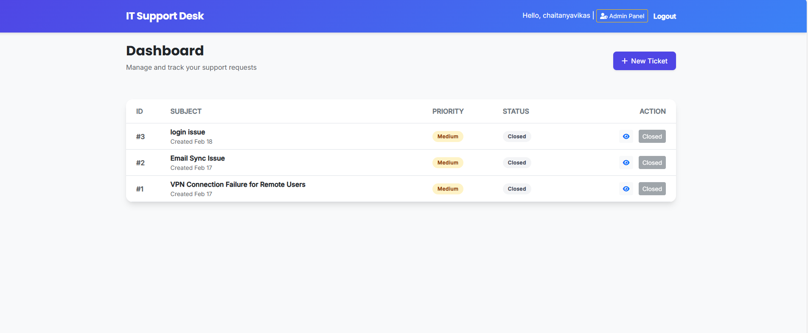
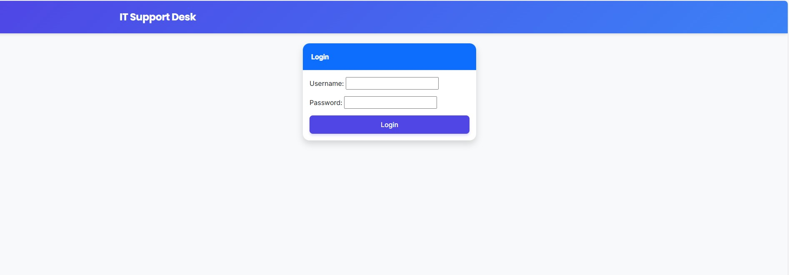

# 🎫 Enterprise IT Support Ticketing System


> A scalable, cloud-native helpdesk solution designed to streamline internal IT support operations. Features role-based access control, real-time ticket tracking, and a hybrid database architecture.

---

## 🚀 Live Demo
**[Click here to view the Live Application](https://support-system-mysql.onrender.com)** *(Note: To test the Admin features, please request demo credentials or run locally.)*

---

## 📸 Screenshots
| **Admin Dashboard** | **Login View** |
|:---:|:---:|
|  |  |

---

## ✨ Key Features

### 🔐 Role-Based Access Control (RBAC)
* **Support Agents (Admin):** Can view all tickets, change statuses (Open/Closed), and manage priority levels.
* **Employees (Users):** Can only view and track their own tickets.
* **Secure Authentication:** Powered by Django's robust auth system.

### 🛠 Ticket Management
* **Lifecycle Tracking:** Create, View, Update, and Close tickets.
* **Priority System:** Categorize issues (High, Medium, Low) for efficient triage.
* **Clean UI:** Responsive Bootstrap 5 interface that works on mobile and desktop.

### ☁️ Cloud-Native Architecture
* **Database:** Connects to **TiDB (Serverless MySQL)** in production for high availability.
* **Deployment:** Hosted on **Render** with Gunicorn and WhiteNoise for static file serving.
* **Security:** Enforced SSL connections for database transactions.

---

## 🛠 Tech Stack

* **Backend:** Python, Django 5.0
* **Database:** MySQL (Local XAMPP), TiDB (Cloud Production)
* **Frontend:** HTML5, CSS3, Bootstrap 5
* **Deployment:** Render, Gunicorn, WhiteNoise
* **Version Control:** Git, GitHub

---

## ⚙️ Local Installation Guide

Want to run this project on your machine? Follow these steps:

### 1. Clone the Repository
```bash
git clone (https://github.com/Chaitanya-vikas/IT-Support-Ticketing-System)
cd support-system
